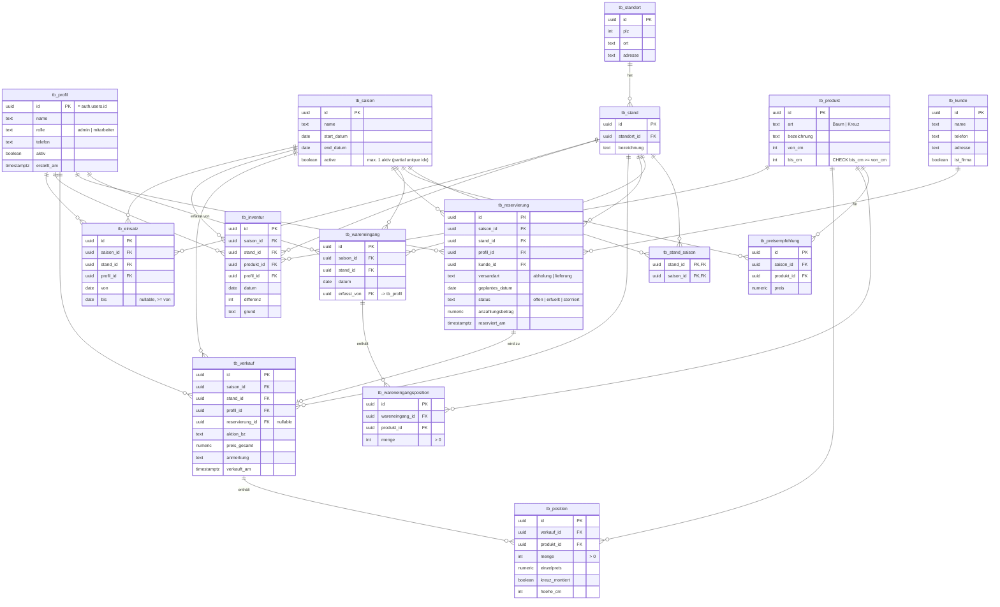

# Grove – Datenbankschema (ERD)

Verkauf von Weihnachtsbäumen/Kreuzen an saisonalen Ständen.

## Legende

- **Saison-unabhängig** (Stammdaten): `tb_profil`, `tb_saison`, `tb_standort`, `tb_stand`,
  `tb_produkt`, `tb_kunde`
- **Saison-abhängig** (Bewegungsdaten): `tb_preisempfehlung`, `tb_wareneingang`(+position),
  `tb_reservierung`, `tb_verkauf`(+position), `tb_inventur`, `tb_einsatz`, `tb_stand_saison`

Die saison-abhängigen Kopf-Tabellen tragen eine direkte `saison_id` (FK auf `tb_saison`).
Positionstabellen (`tb_position`, `tb_wareneingangsposition`) erben die Saison über ihre
Kopfzeile und haben daher keine eigene `saison_id`. `tb_stand_saison` ist die M:N-Zuordnung,
über die derselbe Stand in mehreren Saisons eingesetzt werden kann.

